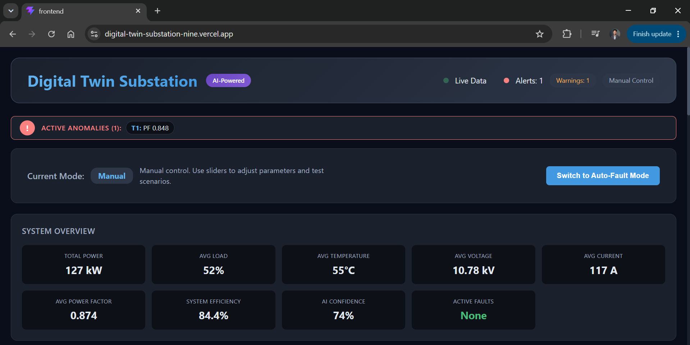
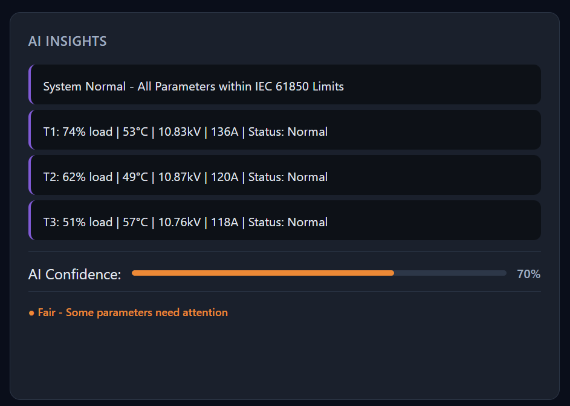
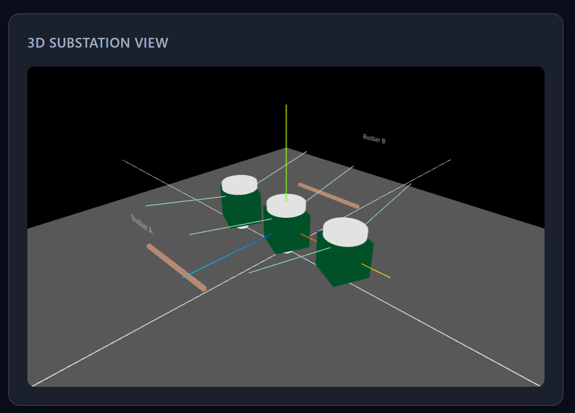
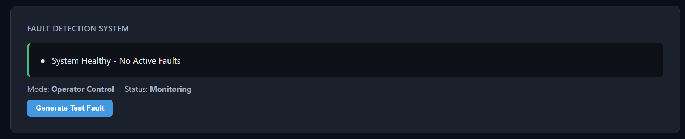
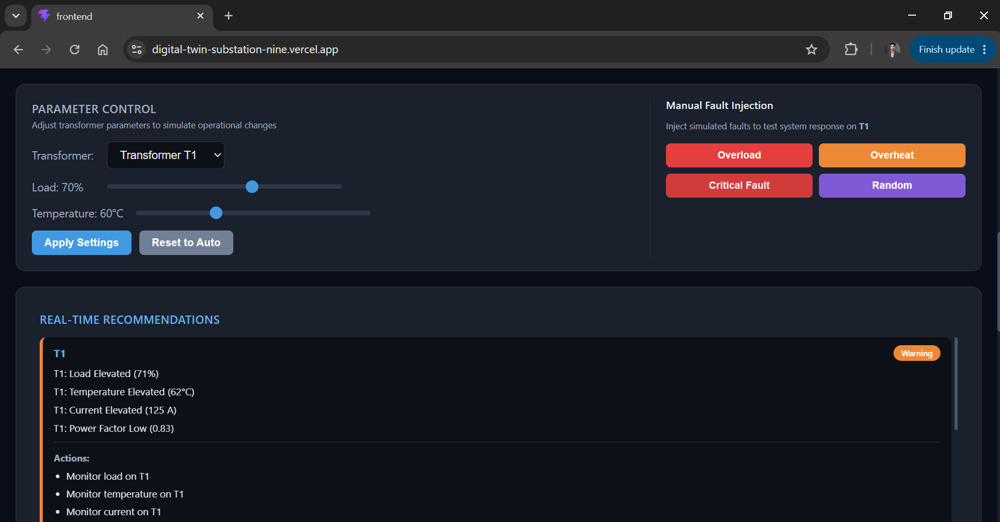
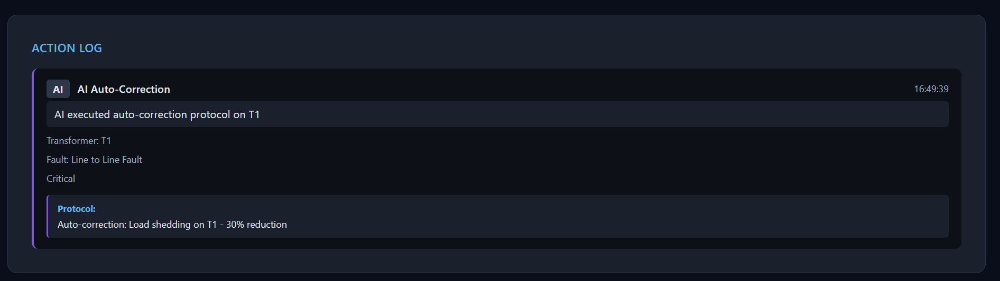
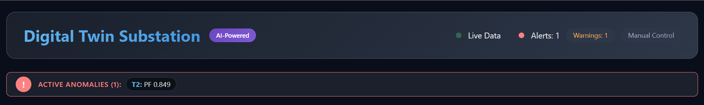

What is a Digital Twin Substation?

A **Digital Twin** is a virtual replica of a physical system that mirrors its real-time behavior. This project creates a **Digital Twin of an Electrical Substation** - a critical component of the power grid that transforms voltage levels for distribution.

# Live Demo
## Live Application:
https://digital-twin-substation-nine.vercel.app/
## GitHub Repository:
https://github.com/Asif96-ai/digital-twin-substation

### Why This Matters

Challenge | How This Project Solves It
**Grid Complexity** Real-time 3D visualization makes complex substation data easy to understand
**Fault Response** AI detects anomalies and auto-corrects within 10 seconds
**Maintenance Costs** Predictive maintenance recommendations prevent expensive failures
**Operator Workload** Intelligent decision support reduces operator burden
**Blackout Prevention** Automated load shedding and fault isolation prevents cascading failures 

### How It Works
1. **Data is generated** from three simulated transformers (T1, T2, T3)
2. **AI Engine analyzes** the data for anomalies and faults
3. **Real-time visualization** shows the substation in 3D
4. **Operators can monitor** and control the system
5. **AI auto-corrects** when faults are detected and no action is taken

## Features

### 3D Digital Twin - "See Your Substation"

The 3D visualization brings your substation to life:
- **Interactive 3D model** built with Three.js - rotate, zoom, and explore
- **Real-time transformer status** with color-coded health indicators
  - 🟢 Green = Healthy
  - 🟡 Yellow = Warning
  - 🔴 Red = Critical
- **Hover tooltips** showing detailed transformer parameters
- **Anomaly highlighting** with visual alerts

**What you see:**
- Three transformers (T1, T2, T3) in their respective bays
- Busbars connecting transformers to the grid
- Feeder lines showing power flow
- Real-time status updates every 2 seconds

###  AI-Powered Intelligence - "Your Smart Assistant"

The AI acts as an intelligent operator assistant:

- **Real-time anomaly detection** - continuously monitors 7+ parameters
- **Dynamic AI Confidence Score** - shows how confident the AI is in its predictions
  - 90-98%: Excellent system health
  - 80-89%: Good with minor deviations
  - 70-79%: Some parameters need attention
  - 60-69%: Warning - several parameters out of range
  - Below 60%: Critical - immediate action required
- **Predictive fault analysis** - forecasts potential issues before they occur
- **Intelligent recommendations** - suggests corrective actions
- **Auto-correction** - if no user action within 10 seconds, AI takes control

### Real-Time Monitoring - "Live Data at a Glance"

The dashboard provides a comprehensive overview:
- **Live data streaming** via WebSocket (updates every 2 seconds)
- **9 key metrics** displayed in System Overview:
  - Total Power (kW)
  - Average Load (%)
  - Average Temperature (°C)
  - Average Voltage (kV)
  - Average Current (A)
  - Average Power Factor
  - System Efficiency (%)
  - AI Confidence (%)
  - Active Faults
- **Historical trends** with interactive charts showing performance over time

### Manual Control & Simulation - "Test Before You Act"

Perfect for training and testing:
- **Parameter adjustment sliders** - manually set load and temperature for any transformer
- **Manual fault injection** with 4 fault types:
  - **Overload** - simulates excessive load on a transformer
  - **Overheat** - simulates cooling system failure
  - **Critical Fault** - simulates severe fault requiring immediate action
  - **Random** - simulates an unpredictable random fault
- **Mode switching**:
  - **Manual Mode** - you are in control, AI assists
  - **Auto-Fault Mode** - AI generates random faults every 3 minutes

### Action & Anomaly Logging - "Complete History"

Everything is logged for audit and analysis:
- **Action Log** - tracks every operator and AI action with timestamps
  - What action was taken
  - Who took it (Operator or AI)
  - When it happened
  - What was the result
- **Anomaly Log** - records all detected anomalies
  - Shows the transformer affected
  - The type of anomaly
  - Recommendations for resolution

### German Standards Compliance

This project follows strict German and European standards:
- **IEC 61850** - Communication networks for power utilities
- **VDE 0100** - Low-voltage installations
- **VDE 0111** - High-voltage installations
- **IEC 60826** - Overhead transmission lines
- **IEC 60076** - Power transformers
## Technology Stack

### Frontend 
React 18.x - UI Framework (handles the dashboard interface)  
Three.js - 3D Visualization (creates the 3D substation model)  
Recharts - Interactive Charts (shows trends and data)  
Socket.IO Client - Real-time Communication (receives live data)  
CSS3 - Styling (makes it look professional)  
Vite - Build Tool (fast development and deployment)  
### Backend 
Node.js 18.x - Runtime Environment (runs the server)
Express.js - Web Framework (handles API requests)
Socket.IO - Real-time WebSockets (streams data to the frontend)
CORS - Cross-Origin Resource Sharing (allows frontend-backend communication)
### Development & Deployment
Git - Version Control (tracks code changes)  
GitHub - Repository Hosting (stores the code)  
Vercel - Frontend Deployment (hosts the website)  
Render - Backend Deployment (hosts the server)  
### Data Flow
SIMULATOR generates transformer data (load, temperature, voltage, current, etc.)  
↓  
AI ENGINE analyzes the data for anomalies and faults  
↓  
BACKEND processes and streams data via WebSocket  
↓  
FRONTEND receives data and updates the 3D model and dashboard  
↓  
OPERATOR sees real-time information and can take action  
↓  
AI AUTO-CORRECTS if no action is taken within 10 seconds  
↓  
ACTION LOG records everything for audit  
##  Screenshots
### Dashboard Overview

*The main dashboard showing the 3D substation model, system metrics, and real-time data.*

### AI Insights Panel

*AI-powered insights with dynamic confidence score and system health analysis.*

### 3D Substation View

*Interactive 3D model of the substation with color-coded transformer health.*

### Fault Detection

*Real-time fault detection with 10-second countdown and action options.*

### Control Panel

*Manual parameter control with sliders for load and temperature adjustment.*

### Action Log

*Complete history of operator and AI actions with timestamps.*

### Anomaly Notification

*Instant notification when anomalies are detected.*

## Installation & Setup
### Prerequisites  
- Node.js 18.x or higher  
- npm 9.x or higher  
- Git  

### Step 1: Clone the Repository
git clone https://github.com/Asif96-ai/digital-twin-substation.git  
cd digital-twin-substation  

### Step 2: Install Backend Dependencies
cd backend
npm install

### Step 3: Install Frontend Dependencies
cd ../frontend
npm install

### Step 4: Configure Environment Variables
Create a .env file in the backend directory:
PORT=5000
### Step 5: Start the Application
Start the Backend Server
cd backend
npm run dev
### Start the Frontend Development Server
cd frontend
npm run dev

### Open Your Browser
http://localhost:5173

# Usage Guide
## For Operators (How to Use the Dashboard)
1. Monitor Substation Status
Look at the 3D model - green is healthy, yellow is warning, red is critical
Check the System Overview for key metrics
Watch the AI Confidence score - it tells you how reliable the AI predictions are
2. Analyze Anomalies
The Anomaly Notification Bar at the top shows active alerts
Click on the Anomaly Log for details on each issue
Read the AI Recommendations for corrective actions
3. Simulate Faults
Switch to Manual Mode if not already
Select a transformer (T1, T2, or T3)
Click a fault button:
Overload - see how the system reacts to high load
Overheat - test temperature warnings
Critical Fault - trigger emergency response
Random - test unpredictable scenarios
4. Take Action
When a fault occurs, you have 10 seconds to respond
Choose "Acknowledge & Take Action" to handle it yourself
Choose "Let AI Handle" to let the AI auto-correct
Watch the Action Log to see what happened
5. Switch to Auto Mode
Toggle to Auto-Fault Mode
AI generates random faults every 3 minutes
AI automatically handles faults if no user response
This mode is ideal for demonstrating AI capabilities
# Author 
**Muhammad Asif**  
*Electrical Engineer | AI Enthusiast | Full-Stack Developer*  

**Digital Twin Substation** was born from a real-world need:
Power grids are becoming increasingly complex. Operators need better tools to monitor, predict, and respond to faults. Traditional systems are reactive - they tell you after something breaks. I wanted to build something proactive - a system that detects problems before they happen and suggests solutions automatically.

